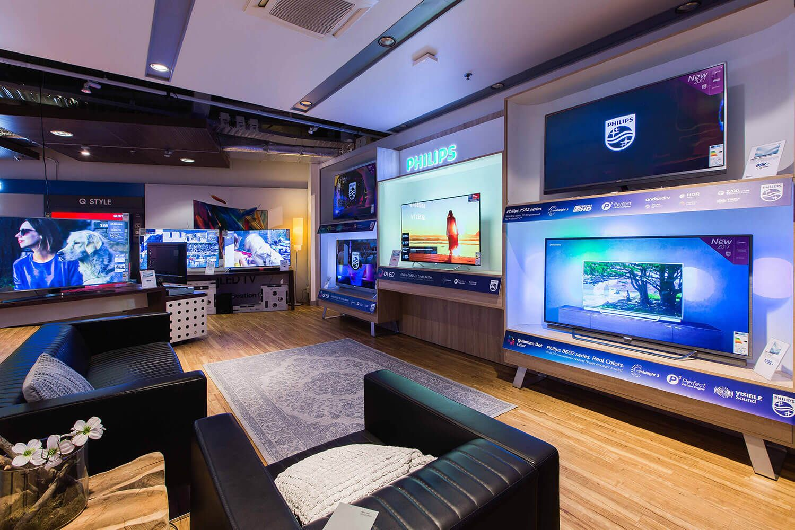

## Inleiding
In de les hebben we het gehad over het technisch ontwerp en het klassendiagram. 

Bij het technisch ontwerp is het belangrijk om te kijken aan welke eisen een applicatie moet voldoen. Hierin maken we onderscheid tussen functionele en niet-functionele eisen. De functionele eisen geven aan wat een applicatie moet kunnen om te kunnen functioneren. Alle eisen die geen betrekking hebben op het functioneren van de app, noemen we niet-functionele eisen.

Aan de hand van het klassendiagram kun je een verhaal vertellen over de applicatie. Hierin wordt duidelijk welke klassen de applicatie heeft en hoe deze in relatie tot elkaar staan.

## Opdrachtbeschrijving
Je gaat de requirements en een klassendiagram voor een fictief bedrijf opstellen. Bij 'Storytime' vind je de informatie die je nodig hebt over dit bedrijf. Vind je het nog lastig om te bepalen of een requirement een functionele of niet-funtionele eis is? Lees dan Hoofdstuk 2 van de cursus Software Design en Documentatie nog eens door.

## Randvoorwaarden
De opdracht moet voldoen aan de volgende voorwaarden:

- minimaal 15 requirements
- minimaal 5 klassen in een klassendiagram

## Storytime 

In 1970 is Dhr. P. Langevelden een televisiewinkel begonnen in Zaandam. Toendertijd waren tv's nog niet zo populair als tegenwoordig. Niet ieder huis had een tv, iets wat we vandaag de dag bijna niet voor kunnen stellen. Dhr. Langevelden heeft zijn kleine winkel redelijk uitgebreid. Hij begon als eenmanszaak en had vorig jaar 30 personeelsleden in vaste dienst. Dit jaar heeft Dhr. Langevelden besloten om te starten met het afbouwen van zijn werkzaamheden: zijn drie kinderen gaan de zaak overnemen. 

Hella (V), de dochter van Dhr. Langevelden heeft ervaring op het gebied van inkoop en administratie en zal dit gedeelte op zich gaan nemen. Paulus (M) heeft al van kleins af aan de gave om zelfs een steen te verkopen als een goudklompje door middel van een praatje. Dit en zijn ervaring als verkoper maken Paulus de ideale man voor leidinggevende van de afdeling Verkoop. De jongste van het gezelschap, Robin (X), heeft vooral in magazijnen gewerkt en zou het fijn vinden als die verantwoordelijk mag zijn voor het magazijn. 

Het drietal gaat na het officieel verdelen van taken en verantwoordelijkheden, aan tafel zitten om de toekomst van "Televisie voor jou!" uit te stippelen. Ze komen al snel overeen dat de naam van de winkel niet meer van deze tijd is. Na lang discussiëren komen ze tot de naam "TechItEasy". Ze besluiten een maand te gaan draaien, zoals de vader het al die jaren heeft gedaan. Hierna zullen ze een nieuwe vergadering hebben. 

Zo gezegd, zo gedaan. Na een maand hebben ze opnieuw een vergadering. Hella geeft aan dat de hoeveelheid papierwerk van het bedrijf groot en veelzijdig is, en geheel compleet. Maar ze vindt het ook een rompslomp: ze moet in verschillende mappen duiken om te kunnen zien wat er is ingekocht en verkocht en besteedt onnodig veel uren aan de administratie. Ze vraagt zich af of dit niet veel makkelijker kan en stelt voor een administratie-applicatie aan te willen schaffen. Robin loopt ook tegen  problemen aan en zou graag een Warehouse Management System (WMS) willen aanschaffen. Paulus zijn frustratie is dat hij heel moeilijk overzicht kan krijgen van wat er op voorraad is en daardoor niet goed zijn acties voor reclame in kan zetten. Maar de kosten van drie nieuwe systemen, die dan ook nog eens moeten kunnen communiceren zijn hoog. En dan is het maar de vraag of ze voldoen aan de gestelde eisen van iedereen.

Ze besluiten een developer in te huren die een applicatie kan bouwen voor het bedrijf. In de vergadering met de developer geeft Paulus aan dat hij graag binnen het systeem wil kunnen zien hoeveel producten er per soort op voorraad zijn en hoeveel er nog binnenkomen. Hella wil kunnen zien wat de prijzen van inkoop en verkoop zijn, maar ook de aantallen per product. Daarnaast wil ze van alle personeelsleden gegevens kunnen opvragen en aanpassen. Robin wil een systeem dat makkelijk aangeeft wat waar staat, op welk moment.

De developer geeft aan dat de applicatie die ze willen erg uitgebreid is. Hij geeft een indicatie van wat het gaat kosten om de applicatie te maken. Het drietal schrikt erg van de prijs, waarop ze besluiten niet met de developer in zee te gaan. Ze bedanken de developer voor zijn tijd en blijven achter zonder applicatie. 

Na nog wat weken het bedrijf op de oude manier te runnen, roept Robin iedereen samen. Bij de samenkomst legt die uit, dat iemand uit diens vriendengroep bijna is afgestudeerd als developer (JA, jij!). Robin wilt vragen of deze beginnende developer de applicatie wilt ontwikkelen voor het bedrijf. De anderen zien dat idee wel zitten. Op deze manier verdient een developer-in-wording wat bij en krijgen zij misschien hun gewenste applicatie voor een lagere prijs. 

Wel beseffen ze dat ze te veel willen om gelijk in een applicatie te stoppen. Ze komen overeen dat voor hun huidige producten, namelijk: tv's, afstandsbedieningen, muurbeugels en ci-modules, de applicatie alles bij moet gaan houden. Ze willen dat er onderscheid gemaakt wordt wat betreft de rechten binnen de applicatie. Hella, Paulus en Robin willen alles kunnen doen wat de app kan, maar personeelsleden mogen slechts bepaalde acties uitvoeren binnen de app. Daarnaast willen ze de naam en mogelijkheden van de producten opslaan in de app en kunnen zien wat de voorraad is en hoeveel producten er verkocht zijn. Ook willen ze dat de app laat zien welk product samen kan met een ander product. Zo is er voor elke tv maar één afstandsbediening mogelijk, maar past een soort ci-module op meerdere tv's en zijn er beugels die voor meerdere tv's beschikbaar zijn. 

Met deze informatie komt Robin bij jou langs.

Hij wil een Minimal Viable Product (MVP) die:
- Informatie alleen bijhoudt over hun tv's, afstandsbedieningen, muurbeugels en CI-modules.
- Duidelijk weergeeft welke producten met elkaar gecombineerd kunnen worden (bijvoorbeeld welke afstandsbediening bij welke tv past).
- Inzicht biedt in de voorraad van elk product.
- Laat zien hoeveel van elk product is verkocht.

## Stappenplan
Let op: het is uitdagender om jouw eigen stappenplan te maken. Als je niet zo goed weet waar je moet beginnen, kun je onderstaand stappenplan gebruiken.

1. Bepaal aan de hand van bovenstaande casus, welke eisen er zijn aan de applicatie. Hiervoor moet je als eerst de hoofdzaken en bijzaken uit de casus van elkaar weten te scheiden. Je kunt daarna op zoek naar werkwoorden in de hoofdzaken, om functionele eisen van te maken.

2. Verdeel de eisen in functioneel en niet-functioneel. De functionele eisen kun je uit de tekst halen, de niet functionele eisen mag je zelf bedenken, houd hierbij wel rekening met de "kenmerken" van niet-functionele eisen zoals die op edhub staan beschreven.
_Tip: Denk bij functionele eisen aan CRUD en kijk op EdHub voor inspiratie om de niet-functionele eisen te bedenken_

3. Haal uit de informatie over het bedrijf welke klassen je nodig hebt in de applicatie. Je kunt op zoek naar zelfstandige naamwoorden in de hoofdzaken van de tekst om te vinden welke klassen nodig zijn.

4. Maak een klassendiagram.

  - Vul de klassen in het diagram in.
  - Bepaal welke relaties er zijn tussen de klassen.
  - Vul alle attributen toe aan de klassen die je nodig denkt te hebben.

